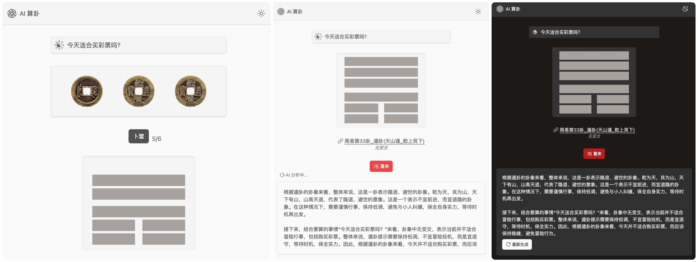

# 🧙 概述

**AI 算卦：** 通过进行六次硬币的随机卜筮，生成卦象，并使用 AI 对卦象进行解读。

[预览地址](https://divination.sunls.vercel.app)

[**V2版本** (暂不开源)](https://divination.sunls.de/)：添加**生辰八字**和**周公解梦**模块

## ⚙️ 设置

#### 环境变量

- `OPENAI_API_KEY`：不必多说，懂的都懂
- `OPENAI_BASE_URL`：自定义 API 接口地址，默认：`https://api.openai.com/v1`
- `OPENAI_MODEL`：自定义 OpenAI 模型，默认：`gpt-3.5-turbo`

## 🚀 本地运行

1. 克隆仓库：

```sh
git clone https://github.com/sunls24/divination
```

2. 安装依赖项：

```bash
pnpm install
```

3. 本地运行：

```bash
# 设置环境变量 OPENAI_API_KEY=sk-xxx
touch .env.local
# 本地运行
pnpm run dev
```

## ☁️ 使用 Vercel 部署

[](https://vercel.com/new/clone?repository-url=https%3A%2F%2Fgithub.com%2Fsunls24%2Fdivination&env=OPENAI_API_KEY)

---


